# ArcGIS Portfolio

Static site and assets showcasing ArcGIS coursework, weekly exercises, and a group project. All images are local so the site is GitHub Pages–ready without external hosting.

## What's inside
- `index.html` / `styles.css` — the portfolio website (open `index.html` or publish with GitHub Pages).
- `files/` — notebooks, docs, and PNG exports organized by lab/week.
- Highlights include digitizing fundamentals, cartographic layout practice, raster analysis, hydrology experiments, and a collaborative final project.

## Quick start
1. Open `index.html` in a browser for a local preview.
2. To publish with GitHub Pages, push to GitHub and enable Pages for the repository (root folder).

## Projects
- Lab 1: Digitizing and base mapping — notebooks and maps in `files/lab-1/`.
- Lab 2: Geodatabase design and layout — assets in `files/lab-2/`.
- Lab 3: Map compilation and labeling — assets in `files/lab-3/`.
- Lab 4: Thematic mapping — assets in `files/lab-4/`.
- Lab 5: Raster analysis practice — assets in `files/lab-5/`.
- Week 8: Hydrology lowering water experiment — assets in `files/week-8/`.
- Week 9: Topographic and slope zonal stats — assets in `files/week-9/`.
- Week 10: Layout refinements — assets in `files/week-10/`.
- Group Project: Proposal, presentation, and report — docs in `files/group-project/`.

## Image gallery (local files)
<table>
  <tr>
    <td>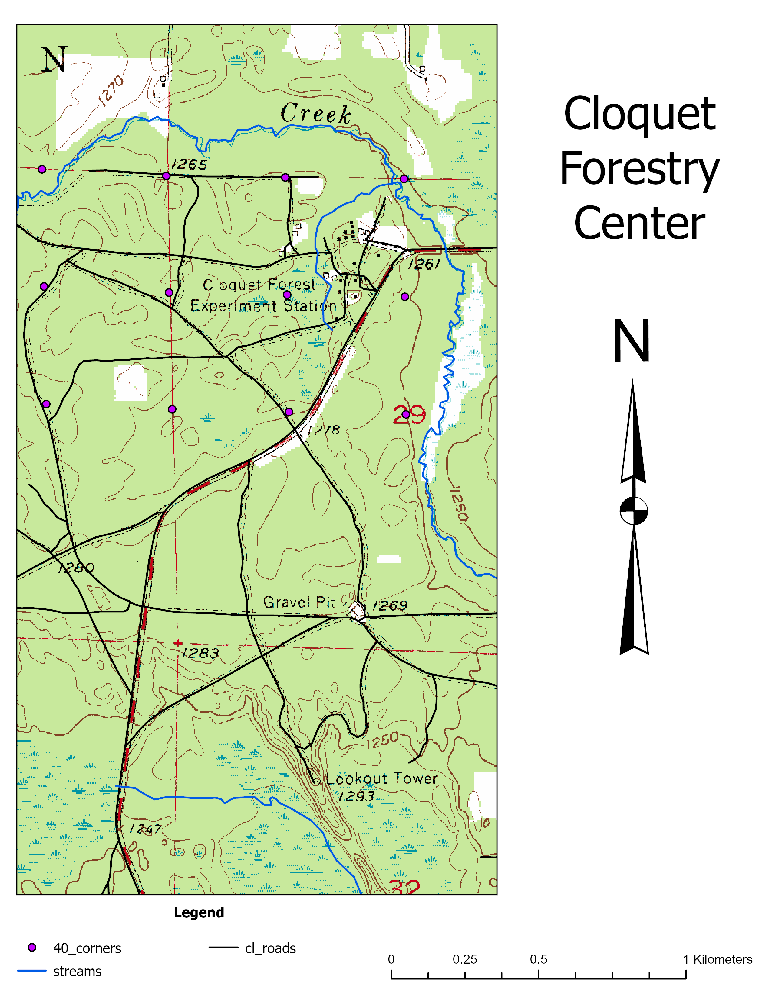 Lab 1 · Clock tower feature</td>
    <td>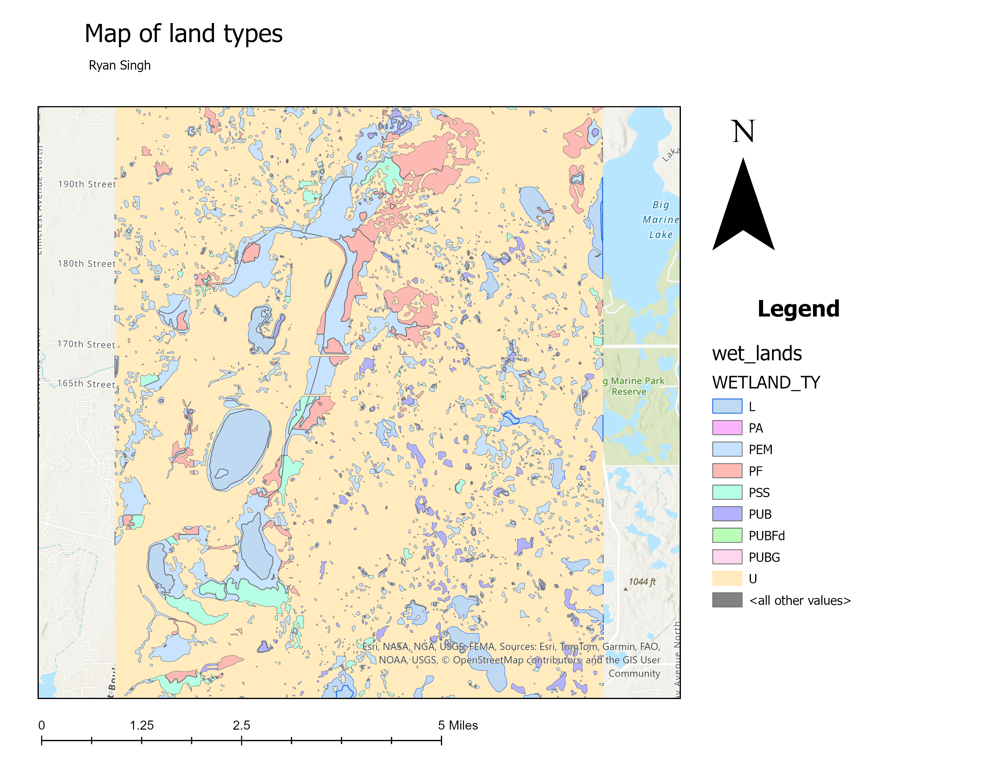 Lab 1 · Wetlands mapping</td>
    <td>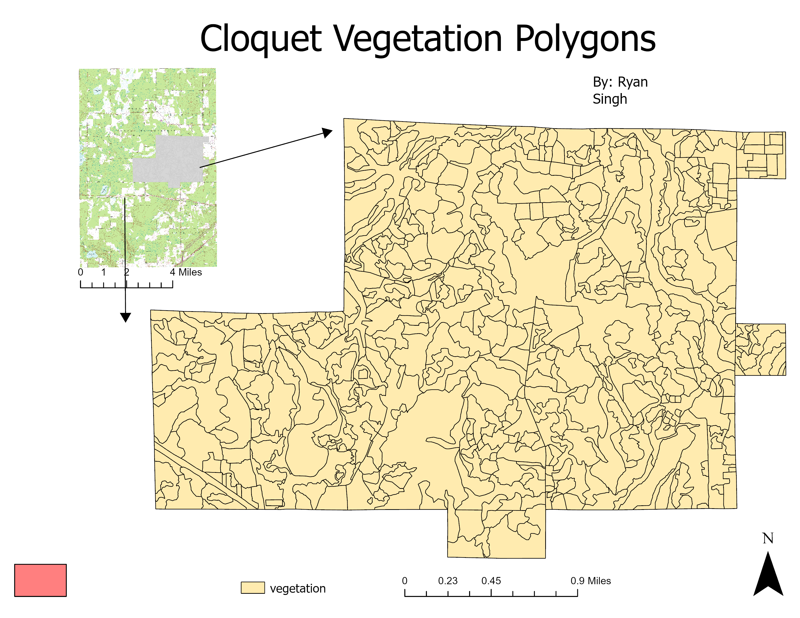 Lab 2 · Final layout</td>
  </tr>
  <tr>
    <td>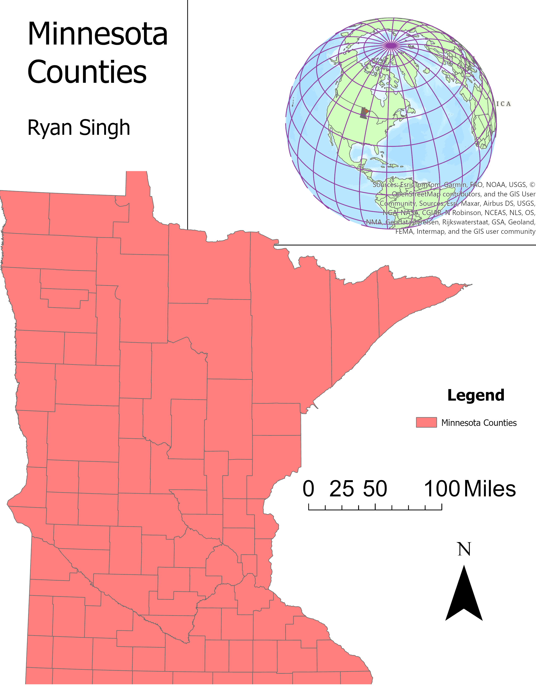 Lab 3 · Compilation layout</td>
    <td>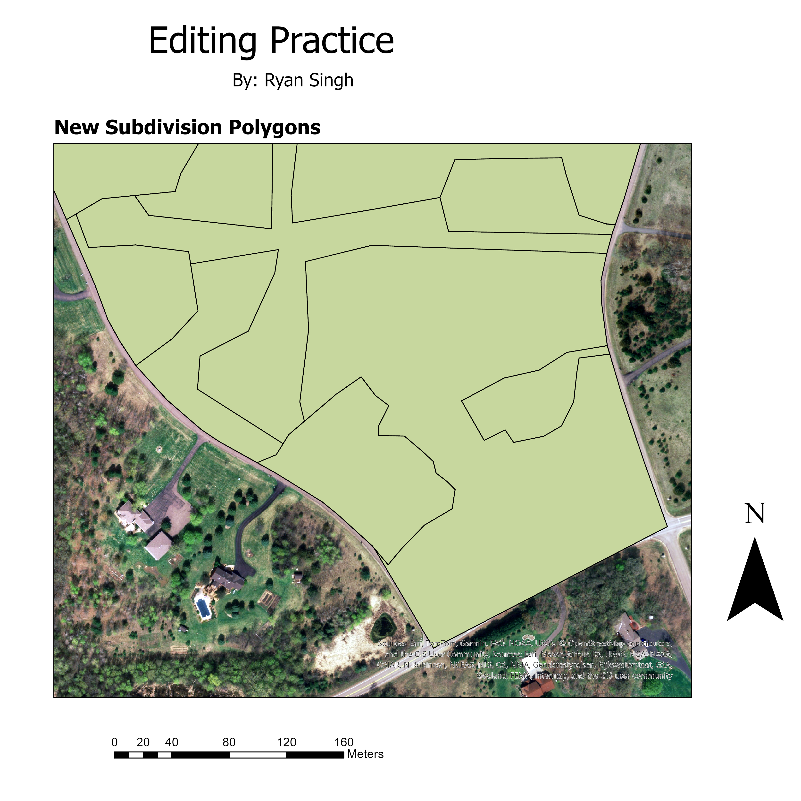 Lab 4 · Thematic mapping</td>
    <td>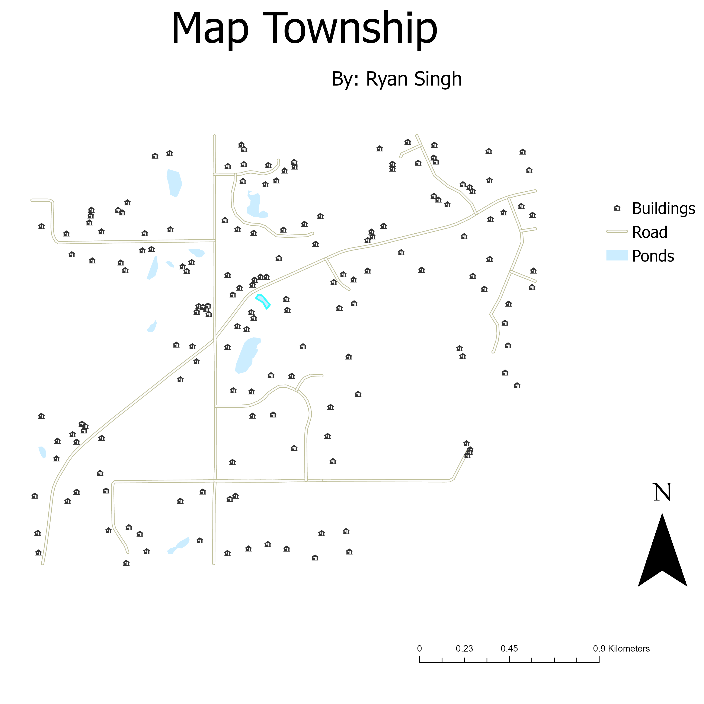 Lab 4 · Alternate layout</td>
  </tr>
  <tr>
    <td>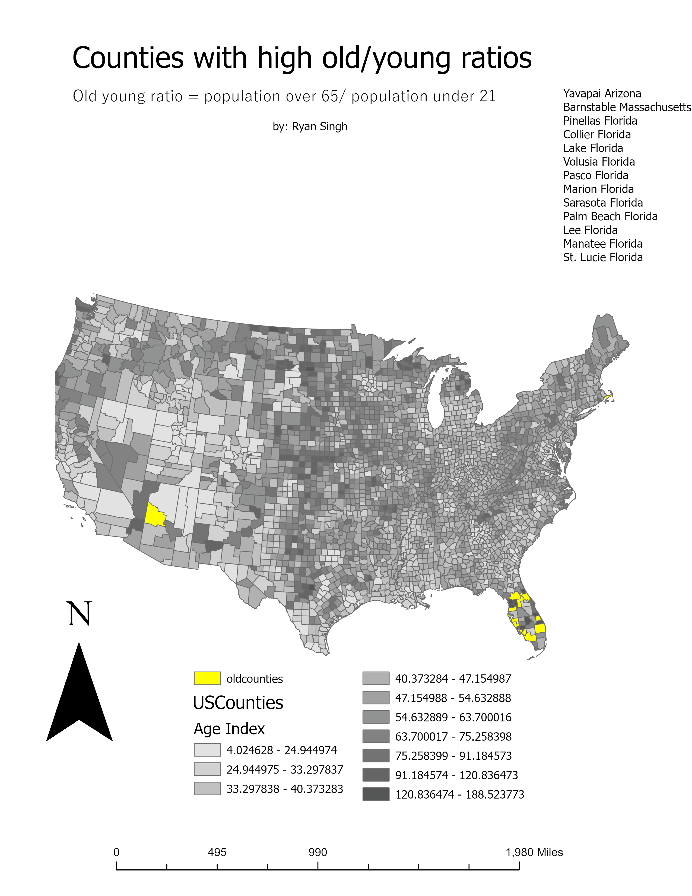 Lab 5 · Raster output 1</td>
    <td>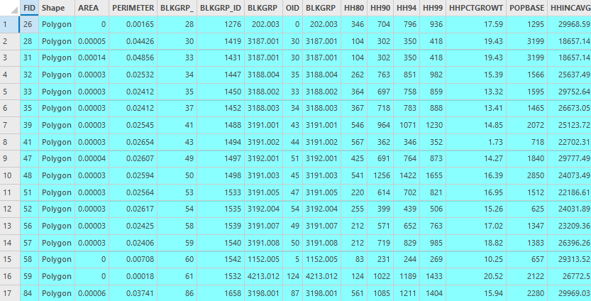 Lab 5 · Raster output 2</td>
    <td>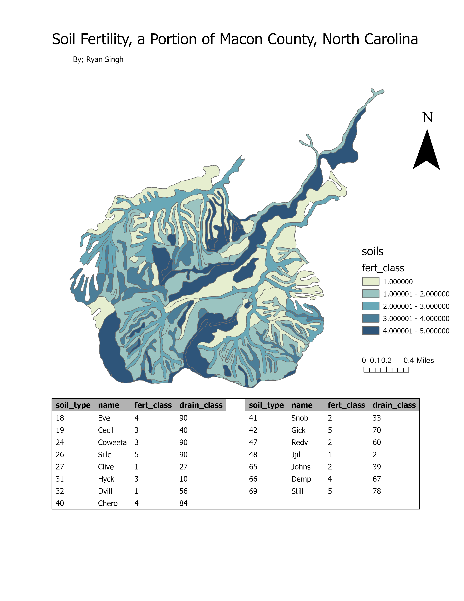 Lab 5 · Raster output 3</td>
  </tr>
  <tr>
    <td> Week 8 · Lower water visualization</td>
    <td>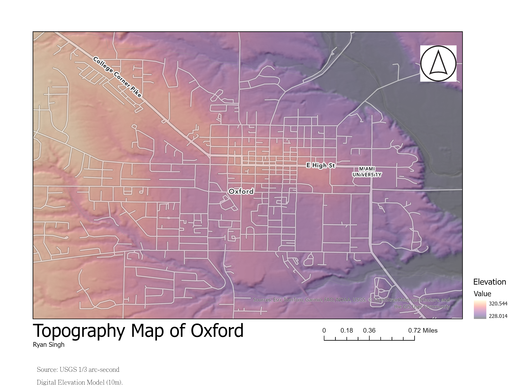 Week 9 · Topo map</td>
    <td>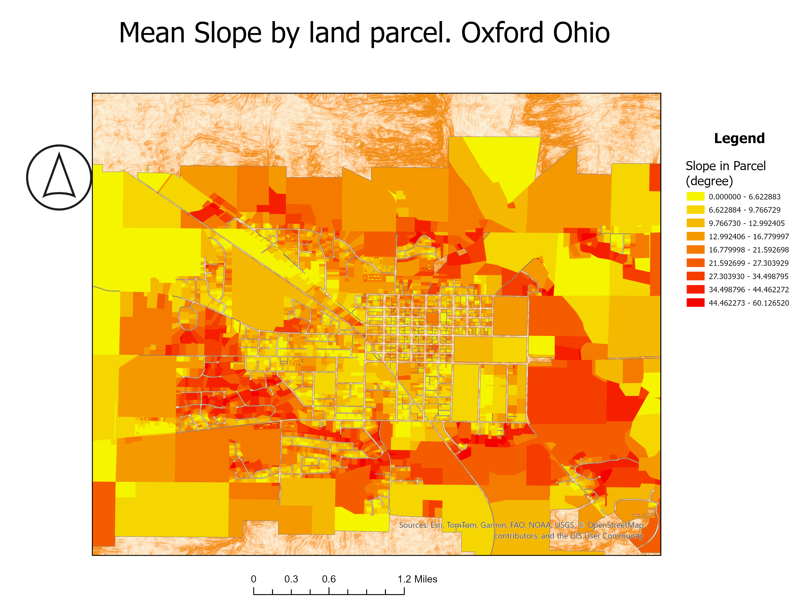 Week 9 · Slope zonal stats</td>
  </tr>
  <tr>
    <td>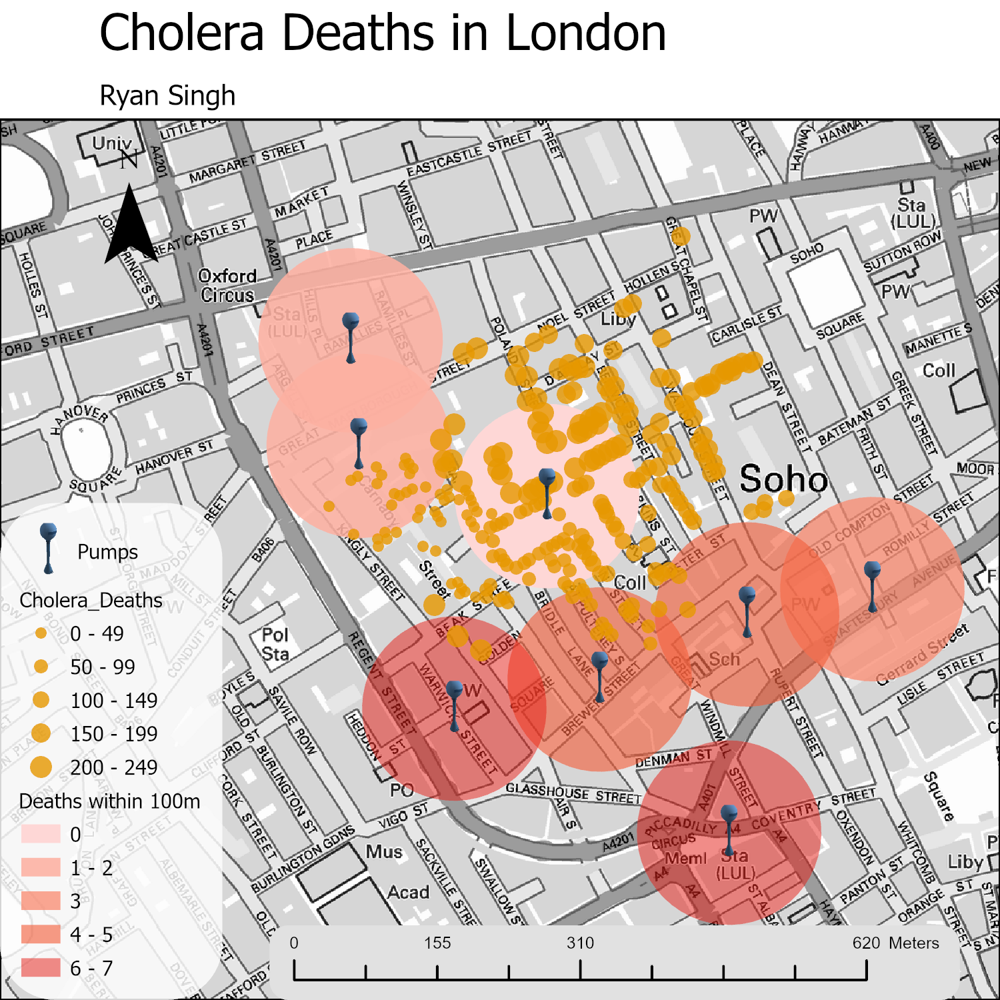 Week 10 · Layout</td>
    <td>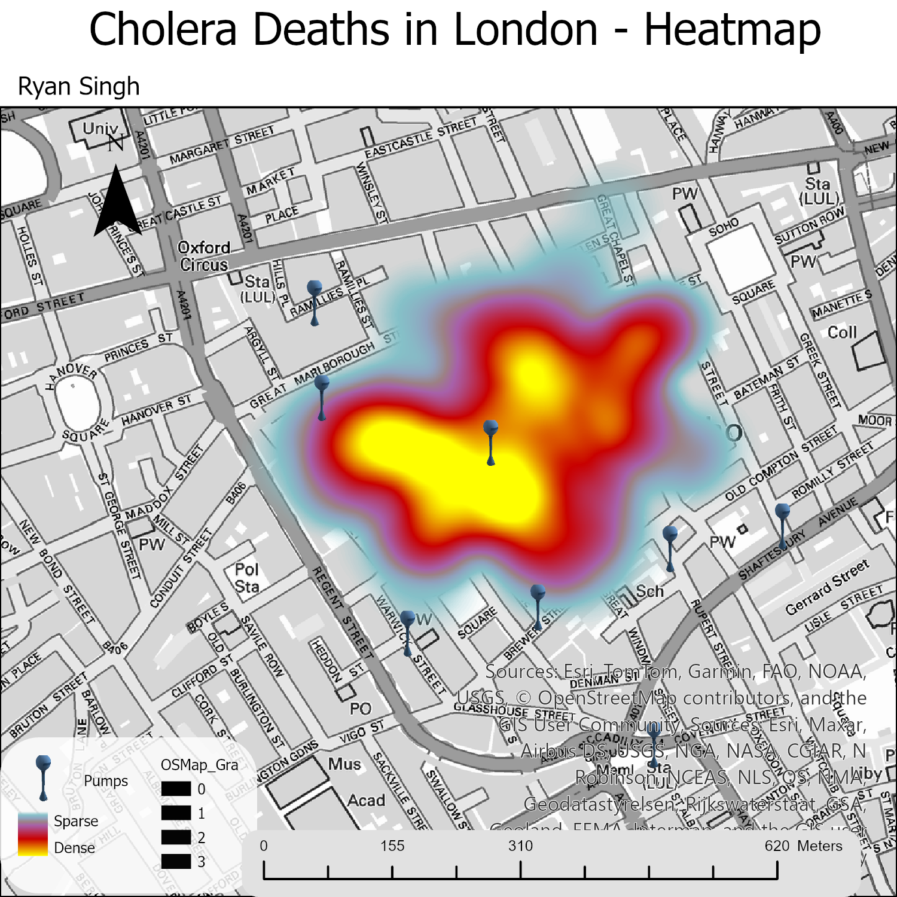 Week 10 · Alternate layout</td>
    <td> Week 10 · Layout detail</td>
  </tr>
</table>
